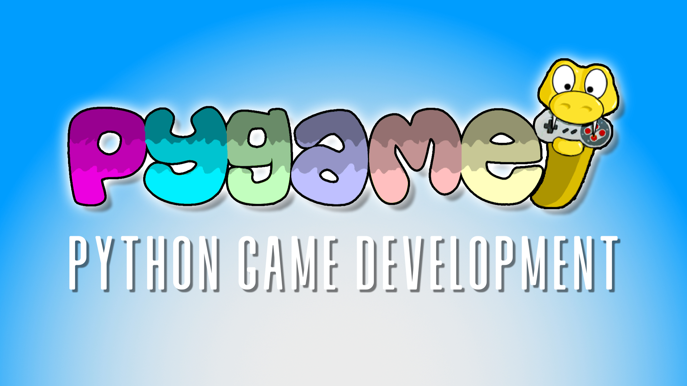
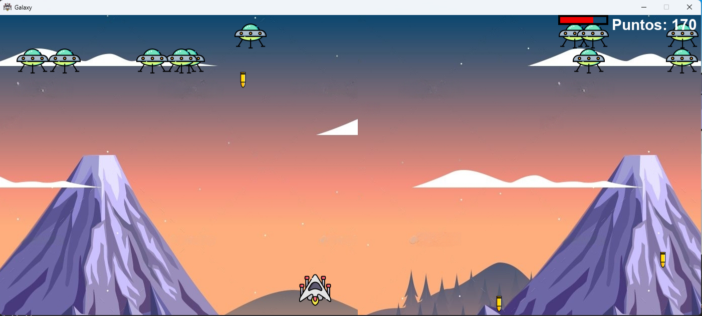
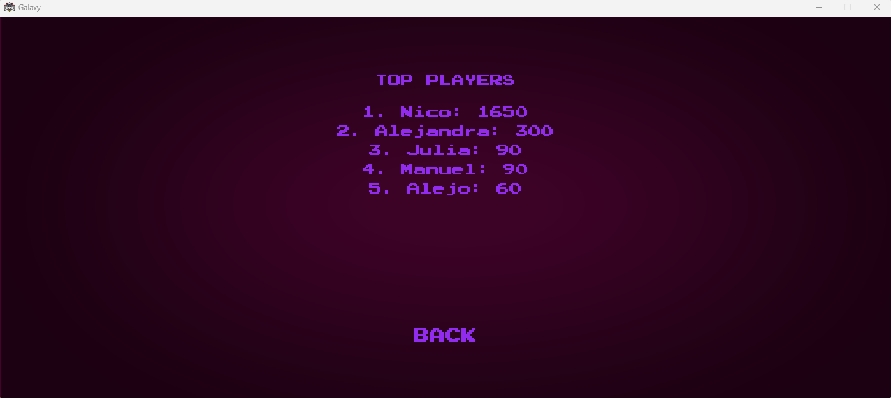

## 📋 Documentación del segundo parcial para la materia Laboratorio I - UTN Tecnicatura Superior en Programación.  

  

## Proyecto: Juego Galaxia.

Proyecto donde se busca tener una introducción a la POO en Python utilizando Pygame. Es una versión preliminar y funcional, donde se puede realizar mejoras y refactorización.

  

## Documentación 🚀
Se requeria que el jugador pueda moverse con su personaje (en este caso el avión principal) en el eje horizontal para poder realizar disparos y esquivar los disparos enemigos. Utilicé SQL Lite para persistir los nombres y puntaje de cada jugador, y como resultado el juego guarda un listado de los 5 mejores jugadores.

[Link del repositorio en Github ](https://github.com/Nicolasgh91/Juego_Galaxia_MVP "Enlace del repositorio")

## Código principal del programa: 🔩

~~~ Python (Lenguaje del código)

import pygame, sys
from config.button import Button
from config.colores import *
from config.configuraciones import *
from enemies import Enemies
from player import *
from explosion import *
from config.tabla_datos import *

pygame.init()

#Creo grupos para poder manejar los objetos con el modulo Sprite.
player_list = pygame.sprite.Group() #Dibuja todos los objetos en simultaneo, es una manera más eficiente de agregar cada uno a una lista, recorrerlos y dibujarlos/renderizarlos y verificar colisiones
enemies_list = pygame.sprite.Group() 
bullet_list_player = pygame.sprite.Group()
bullet_list_enemies = pygame.sprite.Group() 

player_one = Player() #Creo instancia del jugador
player_list.add(player_one) #Lo agrego a la lista de jugadores. Lo agrego para poder actualizarlo y dibujarlo en la pantalla
bullet_list_player.add(player_one) #Lo agrego al grupo de balas para poder "matchearlas" con la posición del jugador
best_five_players = []

i = 0
while i < 10: #Creo por única vez sólo 10 enemigos.
    enemigo = Enemies()
    enemies_list.add(enemigo) 
    player_list.add(enemigo)
    i += 1

def play():    
    flag_first_game = False
    SHOOT_EVENT = pygame.USEREVENT + 1
    pygame.time.set_timer(SHOOT_EVENT, 1500) #Temporizador para agregar un disparo más al grupo de enemigos, cada X tiempo
    clock.tick(fps)
    enemigo = Enemies()
    enemies_list.add(enemigo) 
    player_list.add(enemigo)
    pygame.mixer.music.play(-1)
    
    #Efecto parallax
    scroll = 0
    galaxy_wallpaper_height = screen_wallpaper.get_height()
    cant_img = math.ceil(S_H / galaxy_wallpaper_height) + 1
    print(cant_img)

    while True:
        clock.tick(fps)
        
        for i in range(0, cant_img):
            SCREEN.blit(screen_wallpaper, (i * galaxy_wallpaper_height + scroll,0)) #Primera es 0, per en la proxima se multiplica x el largo de la imagen
        scroll -= 0.5
        
        if abs(scroll) > galaxy_wallpaper_height:
            scroll = 0

        #Inicio eventos
        for event in pygame.event.get():
            if event.type == pygame.QUIT:
                pygame.quit()
                sys.exit()
            if event.type == SHOOT_EVENT:
                enemigo.shoot_e(player_list, bullet_list_enemies) #Evento personalizado para que disparen aleatoriamente.
            if event.type == pygame.KEYDOWN:
                if event.key == pygame.K_SPACE:
                    player_one.shoot(player_list, bullet_list_player) #Por cada bala disparada, la agrego a una lista de balas que reutilizará el enemigo y disparará
                if event.key == pygame.K_ESCAPE:
                    main_menu() #Tecla escape te lleva al menú principal
        #Fin eventos
        
        #Actualizo a cada bjeto de la lista, posición de jugador y enemigo, y la posicion de sus balas respectivamente. 
        player_list.update() 
        enemies_list.update()
        bullet_list_enemies.update()
        bullet_list_player.update()
        player_list.draw(SCREEN)#Una vez actualizadas las posiciones, las renderizo/dibujo

        #Si se detecta una colisión entre un enemigo y una bala, se agrega una entrada al diccionario colision_player_enemy donde la clave es el enemigo y el valor es una lista de las balas que colisionaron con ese enemigo.
        #Colisiones balas jugador con enemigos // Detecto colisiones entre el grupo de enemigos y el grupo de balas
        colision_player_enemy = pygame.sprite.groupcollide(enemies_list,bullet_list_player,True,True)#El 3er y 4to parametro es para eliminar los objetos que colisionan.
        
        for i in colision_player_enemy:
            player_one.ply_score += 10
            enemigo.shoot_e(player_list,bullet_list_enemies)# De la lista de balas que recuperó x cada disparo del jugador, las usa el enemigo 
            enemigo = Enemies() #Por cada colisión creo otro enemigo
            enemies_list.add(enemigo)
            player_list.add(enemigo)
            explosion = Explosion(i.rect.center) #Crea una explosión en la posición central del enemigo colisionado, utilizando el rectángulo de colisión (i.rect) del enemigo.
            player_list.add(explosion)
            explosion_sound.set_volume(0.3)
            explosion_sound.play()

        #Colisiones balas enemigo con el jugador
        colision_enemy_bullets = pygame.sprite.spritecollide(player_one, bullet_list_enemies, True) #Elimino las balas pero no el jugador

        for i in colision_enemy_bullets:
            player_one.life -= 10 #Por cada colisión le resto X de vida
            explosion_bull_ply = Explosion(i.rect.center) #Explosión x balas del enemigo colision con el jugaodr
            player_list.add(explosion_bull_ply)
            hit_sound.play()

            if player_one.life <= 0:
                bullet_list_enemies.empty() #Vacio la lista de balas enemigas que quedaron en pantalla cuando murio el jugador
                
                pygame.display.flip()
                pygame.display.update()
                best_five_players.append({ player_one.ply_name : player_one.ply_score}) #Agrego el jugador a la lista de los mejores
                flag_first_game = True
                
                with sqlite3.connect("config/galaxy_best_players.db") as conexion:
                    try:
                        conexion.execute('''
                            INSERT INTO jugadores (nombre, puntaje) VALUES (?,?)
                        ''', (player_one.ply_name, player_one.ply_score)) #Agrego el jugador a la base de datos

                    except sqlite3.OperationalError:
                        print("Hubo algún error al cargar los datos del jugador a la base de datos")
                    
                player_one.ply_score = 0 #Reinicio los stats del jugador
                player_one.life = 100
        
        #Renderizo
        render_text_score(SCREEN, (" Puntos: "+ str(player_one.ply_score)+ "   " ), 30, S_W - 85, 2) #Renderizo constantemente la vida del jugador
        render_life_bar(SCREEN, S_W - 285, 0, player_one.life)
        pygame.display.flip()
        pygame.display.update()
        
        if player_one.ply_score == 0 and flag_first_game:
            flag_first_game = False
            score() # Si perdes, te lleva directo a la pantalla de puntaje
#//////////////////////////////////////////////////////////////////

#//////////////////////////////////////////////////////////////////
def score():
    SCREEN.blit(BG, (0, 0))
    while True:
        pygame.mixer.music.stop()
        SCORE_MOUSE_POS = pygame.mouse.get_pos()  
        SCORE_BACK = Button(image=None, pos=(S_W / 2, S_H / 2 + 200), text_input="BACK", font=get_font(25), base_color=PURPLE2, hovering_color=WHITE)
        SCORE_BACK.changeColor(SCORE_MOUSE_POS)
        SCORE_BACK.update(SCREEN)
        
        top_players_list = [] 
        top_five_players = get_font(20).render("TOP PLAYERS", True, PURPLE2)
        top_five_players_rect = top_five_players.get_rect(center=(S_W / 2, S_H / 2 - 200))
        y_position = S_H / 2 - 150 #Donde arranca la posición del primer jugador
        
        with sqlite3.connect("config/galaxy_best_players.db") as conexion:   #Solo selecciono los primeros 5 jugadores (si los hay)
            try: #Ordeno la table de manera descendente
                cursor = conexion.execute('''
                SELECT nombre, puntaje FROM jugadores
                ORDER BY puntaje DESC
                LIMIT 5
                ''')
                for fila in cursor: #Recorro cada fila de la tabla y me guardo los valores en una lista.
                    nombre = fila[0]
                    puntaje = fila[1]
                    top_players_list.append((nombre, puntaje))
                conexion.commit()         
            except sqlite3.OperationalError:
                print("No se pudo ordenar la tabla")
            
        for i, player in enumerate(top_players_list): #Esa lista que obtuve de la consulta con SQL, la recorro e imprimo en pantalla cada fila obtenida
            jugador_text = get_font(20).render(f"{i + 1}. {player[0]}: {player[1]}", True, PURPLE2) #Imprimo las posiciones de la tupla que guarde en la lista, y el iterador lo utilizo para indicar la posición que obtuvo el jugador con respecto a su puntaje
            jugador_rect = jugador_text.get_rect(center=(S_W / 2, y_position))
            SCREEN.blit(jugador_text, jugador_rect)
            y_position += 30 #Después de renderizar un jugador, el próximo se renderiza 30px abajo 

        for event in pygame.event.get():
            if event.type == pygame.QUIT:
                pygame.quit()
                sys.exit()
            if event.type == pygame.MOUSEBUTTONDOWN:
                if SCORE_BACK.checkForInput(SCORE_MOUSE_POS): #Si hago click con el mouse en back, me lleva al menú principal
                    main_menu()

        SCREEN.blit(top_five_players, top_five_players_rect) #Actualizo la lista de jugadores en la pantalla
        pygame.display.update()
#//////////////////////////////////////////////////////////////////

#Obtengo el nombre y puntaje del jugador, creo una pantalla que se muestra despues de presionar el botón play
def obtain_usr_data():
    insert_name_text = get_font(20).render("INSERT NAME", True, PURPLE2)
    insert_name_rect = insert_name_text.get_rect(center=(S_W / 2, S_H / 2 - 100))
    font = get_font(25)
    text_input = ""
    running = True

    while running:
        for event in pygame.event.get():
            if event.type == pygame.QUIT:
                pygame.quit()
            if event.type == pygame.KEYDOWN:
                if event.key == pygame.K_RETURN:
                    player_one.ply_name = text_input #Despues de que el usuario apreta enter, salgo de este bucle y paso al juego
                    if len(text_input) == 0:
                        obtain_usr_data() #Pequeña validacion para que al menos ponga un caracter como nombre el usuario
                    running = False
                if event.key == pygame.K_BACKSPACE: #Para que el usuario pueda borrar caracteres de su nombre
                    text_input = text_input[:-1]
                else:
                    text_input += event.unicode #Tomo cualquier caracter del unicode
        
        SCREEN.blit(BG, (0, 0))
        text_surface = font.render(text_input, True, PURPLE2)
        SCREEN.blit(text_surface,(S_W / 2 - 120,S_H / 2))
        SCREEN.blit(insert_name_text, insert_name_rect)
        pygame.display.update()
#//////////////////////////////////////////////////////////////

#Menu principal que renderiza tres botones y redirije a la función correspondiente.
def main_menu():
    while True:
        pygame.mixer.music.stop()
        SCREEN.blit(BG, (0, 0))
        MENU_MOUSE_POS = pygame.mouse.get_pos()

        #Posiciono los botones
        PLAY_BUTTON = Button(image=img_play_btn, pos=(S_W / 2, S_H / 2 - 80), 
                    text_input="PLAY", font=get_font(25), base_color=PURPLE2, hovering_color=WHITE)
        SCORE_BUTTON = Button(image=img_opt_btn, pos=(S_W / 2, S_H / 2 - 20), 
                            text_input="SCORE", font=get_font(25), base_color=PURPLE2, hovering_color=WHITE)
        QUIT_BUTTON = Button(image=img_quit_btn, pos=(S_W / 2, S_H / 2 + 40), 
                            text_input="QUIT", font=get_font(25), base_color=PURPLE2, hovering_color=WHITE)

        for button in [PLAY_BUTTON, SCORE_BUTTON, QUIT_BUTTON]: #Actualizo cada boton en caso de pasar con el mouse por arriba (le cambio el color)
            button.changeColor(MENU_MOUSE_POS)
            button.update(SCREEN)
        
        for event in pygame.event.get():
            if event.type == pygame.QUIT:
                pygame.quit()
                sys.exit()
                
            if event.type == pygame.MOUSEBUTTONDOWN:
                if PLAY_BUTTON.checkForInput(MENU_MOUSE_POS): #Al presionar play
                    obtain_usr_data() #Ejecuto primero una ventana que pide el nombre de usuario
                    play() #Cuando el usuario dio enter al poner su nombre, ejecuto el juego
                elif SCORE_BUTTON.checkForInput(MENU_MOUSE_POS):
                    score() #Pantalla con puntajes más altos
                if QUIT_BUTTON.checkForInput(MENU_MOUSE_POS):
                    pygame.quit()
                    sys.exit()

        pygame.display.update()

main_menu()

~~~

## 🤖 Link al proyecto 

[Pequeño video con gameplay en un Drive ](https://drive.google.com/file/d/1mSQ-GlLSqa0s3Hhk2uDIFjFFGeHfVKlD/view?usp=sharing "Enlace del gameplay")

##  📘 Fuentes

- [Tecnicatura Universitaria en Programación - UTN](http://www.sistemas-utnfra.com.ar/#/pages/carrera/tecnico-programacion/resumen)

Made with ❤️ by Nicolás Gabriel Hruszczak